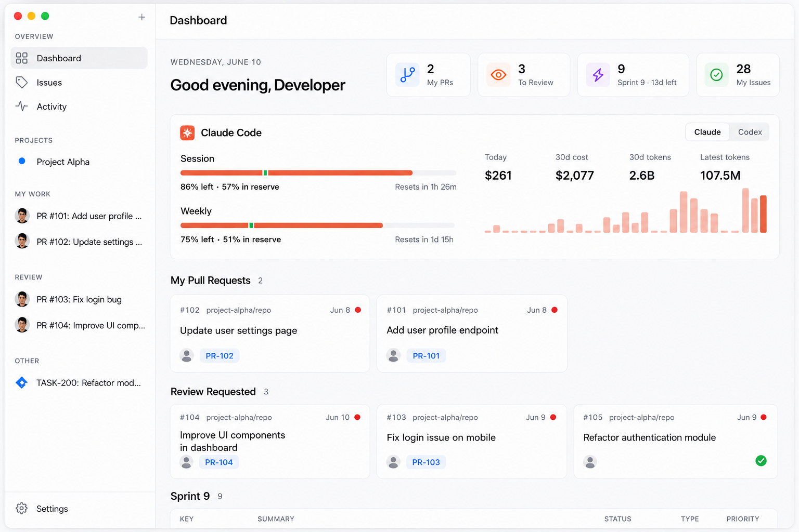
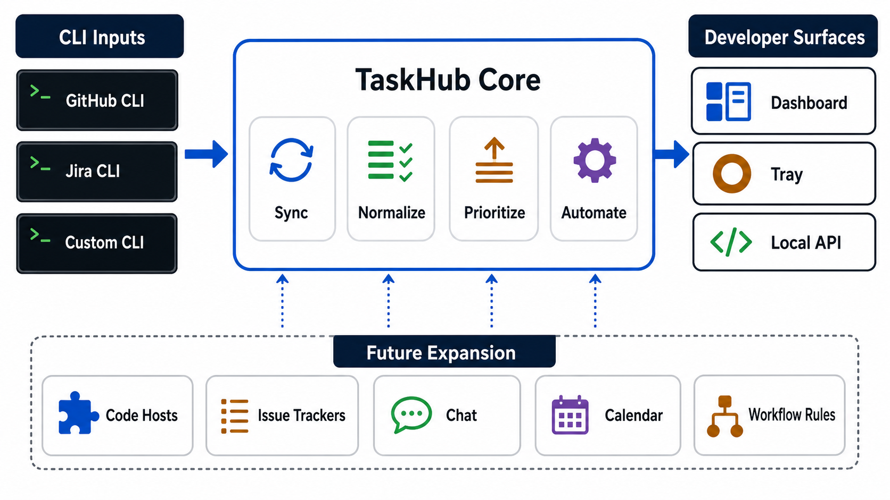

# TaskHub

**A local desktop command center for developers who live in GitHub, Jira, and
the terminal.**

[](#running-taskhub)
[](#running-taskhub)
[](#menu-bar-app)
[](#cli-native-by-design)
[](#license)

TaskHub turns the CLIs you already trust into a fast task and flow desktop app.
It watches your GitHub pull requests, review requests, CI state, and Jira work
items per project, then gives you a local web dashboard plus a tiny macOS
menu-bar signal.



No hosted backend. No personal access tokens in another app. No SaaS workspace
to configure. Just authenticated CLI inputs, a local TaskHub core, and surfaces
that keep your work queue visible.



High-level flow: CLI inputs feed TaskHub Core, TaskHub Core powers developer
surfaces, and the same shape can expand to more code hosts, issue trackers,
chat tools, calendars, and workflow rules.

If your day starts with `gh pr list`, checking CI, and nudging Jira tickets by
hand, TaskHub is the glue layer.

## Why Developers Use It

- **CLI-native by design** - TaskHub reads GitHub through `gh` and Jira through
  Atlassian's `acli`, so auth stays in the tools you already use.
- **Local-first and private** - data lives in local SQLite files (via Node's
  built-in `node:sqlite`, no native deps); the UI reads a lean snapshot instead
  of calling hosted services on every click.
- **Built for real review flow** - your authored PRs, requested reviews, draft
  state, labels, linked Jira keys, and CI status are grouped where you need them.
- **Menu-bar awareness** - a small tray dot tells you when you have work or
  reviews without living in a browser tab.
- **Merge automation** - when a PR merges, linked Jira tickets can automatically
  move to the project's configured status.
- **Hackable core** - plain Node, Express, Electron, and a framework-free
  vanilla-JS SPA (ES modules, no build step) make the project easy to inspect,
  fork, and extend.

## What It Does

TaskHub organizes work around **projects**. Each project has a name, a color, one
GitHub repo, an optional Jira JQL query, and an optional Jira transition to run
when linked PRs merge.

- **Dashboard** shows only your active queue: PRs you authored under Tasks, and
  non-draft PRs requesting your review under Review.
- **AI usage hero** surfaces your Claude Code / Codex token spend at the top of the
  dashboard — session and weekly burn, today's cost, 30-day cost/tokens, and a recent
  trend sparkline — read from `ccusage` (see `lib/usage.js`) and cached SWR-style.
- **Project pages** show all open PRs for a repo, plus a Jira tab for the
  project's JQL query.
- **Inline CI** uses GitHub's `statusCheckRollup` through `gh`, so each PR gets a
  compact pass, fail, or running signal.
- **Activity page** shows a day-grouped timeline of PR lifecycle events, Jira
  transitions, sync errors, and automation failures, with diagnostic categories
  (webhook, poller, …) one filter away.
- **Webhook forwarding** can catch merged PRs quickly through the `gh webhook`
  extension, while the poller remains the fallback.
- **macOS tray app** forks the local server, shows Tasks and Review items, and
  opens the dashboard on demand.

## CLI-Native By Design

TaskHub intentionally does not ask you to paste GitHub or Jira API tokens into a
new app.

Instead:

- GitHub data comes from the authenticated `gh` CLI.
- Jira data comes from the authenticated Atlassian `acli` CLI.
- The sync loop writes a local snapshot.
- The web dashboard and tray read that snapshot instantly.

This keeps the app small, local, and compatible with the permission model your
team already uses in the terminal.

## Running TaskHub

### Prerequisites

- macOS for the menu-bar app. The local web server can run anywhere Node can run.
- Node.js and npm.
- GitHub CLI (`gh`) installed and authenticated.
- Atlassian CLI (`acli`) installed and authenticated for Jira features.
- Bun is optional, but recommended for hot-reload development.

### Start the Web Dashboard

```bash
npm install
npm start
```

Open [http://localhost:3000](http://localhost:3000), create a project, and add a
GitHub repo in `owner/repo` format. Add JQL and an on-merge Jira transition if
you want Jira integration.

For hot reload during development:

```bash
npm run dev
```

`npm run dev` runs `./dev.sh`: it frees the port, watch-runs `server.js` with
`bun --watch` (falling back to `node --watch` if Bun is absent), and opens the
browser. `npm start` is enough for normal local use.

### Menu-Bar App

For a quick Electron tray run:

```bash
npm run dev:tray
```

For the packaged arm64 macOS app:

```bash
./build.sh          # build the .app, ad-hoc sign it, and launch
./build.sh --no-run # build only
```

Build output lands at:

```text
dist/mac-arm64/TaskHub.app
```

`build.sh` regenerates icons, builds the `.app` (ad-hoc signed, fast), kills any
old TaskHub instance, frees port 3000, and launches the new build. To produce a
distributable disk image instead, see [Releasing](#releasing--auto-update).

## How It Works

TaskHub uses a stale-while-revalidate model with a local snapshot as the single
source of truth for UI reads.

```text
gh / acli -> sync loop -> data.db (snapshot cache) -> API + SSE -> dashboard + tray
                         |
                         +-> PR lifecycle events -> Jira merge automation
```

The important rule: **request handlers do not call `gh` for normal dashboard
data**. The poller fetches data, writes a lean snapshot, and the UI reads it.

- `lib/poller.js` is the only regular `gh` caller.
- Each project is fetched roughly once per `poll_interval` seconds.
- Open PR snapshots are served instantly from `data.db`.
- Stale reads trigger background revalidation.
- `/api/stream` uses Server-Sent Events to refresh open pages after sync.
- Merge automation extracts Jira keys from PR titles, PR bodies, and manual PR
  links, then transitions matching Jira work items.

This keeps the UI responsive and keeps GitHub CLI/API usage predictable.

## Architecture

| Layer | Files | Role |
| --- | --- | --- |
| Server | `server.js` | Express routes, SSE, GitHub webhook receiver, static app serving |
| Sync engine | `lib/poller.js` | Poll projects, write snapshots, detect PR lifecycle changes, run merge automation |
| GitHub adapter | `lib/github.js` | Wrap `gh`, parse repos, classify PRs, summarize CI |
| Jira adapter | `lib/jira.js` | Wrap `acli` work item search, view, and transition commands |
| Storage | `lib/db.js`, `lib/configdb.js`, `lib/datadb.js`, `lib/logdb.js` | SQLite via built-in `node:sqlite`: `taskhub.db` (durable app data), `data.db` (volatile CLI snapshot cache), `logs.db` (rolling activity/diagnostic log). `db.js` is the facade callers require |
| Logging | `lib/logger.js` | electron-log file transports per process; routes existing `console.*` call sites |
| Webhook forwarder | `lib/webhook-forwarder.js` | Manage `gh webhook forward` child processes per repo |
| Web UI | `public/index.html`, `public/js/` | No-build ES-module SPA: `index.html` holds markup + stylesheet; `store.js` holds renderer state; `views/*` render pages from it (see `CLAUDE.md` for the pattern) |
| Tray app | `tray.js`, `main/` | Electron menu-bar app that forks the server; `main/` splits menu, notifications, terminals (PTYs), window, updater, and server supervision |
| Build scripts | `scripts/*.js`, `build.sh`, `electron-builder.config.js` | Generate icons, package, sign, and publish the Electron app |

## Data Model

```js
// project row in taskhub.db (returned camelCase by the API)
{ id, name, color, repo, workspace, jiraProjectKey, jql,
  mergeTransition, forwardWebhooks, created_at }

// snapshot row in data.db, keyed by project UUID
// (or '@me' / '@sprint' for the global Jira feeds)
{ prs, lastSynced, error }

// lean PR consumed by UI and tray
{
  number, title, url, state, repo, headRefName,
  author, createdAt, isDraft, labels, jiraKeys,
  ci, category, awaitingMyReview, reviewDecision
}
```

PR category is computed relative to the current `gh` user:

- `mine`: you authored it, shown as Tasks.
- `review`: review requested from you and not draft, shown as Review.
- `other`: visible on project pages only.

Data location:

```text
TASKHUB_DATA_DIR -> Electron userData -> repo root in development
```

The tray passes `TASKHUB_DATA_DIR` to the forked Node server so packaged builds
write outside the app bundle.

## HTTP API

| Method | Path | Notes |
| --- | --- | --- |
| `GET` | `/api/dashboard` | Projects plus snapshotted open PRs |
| `GET` | `/api/projects` | List projects |
| `GET` | `/api/projects/:id` | Get one project |
| `POST` / `PUT` / `DELETE` | `/api/projects[/:id]` | Create, update, or delete projects |
| `GET` | `/api/projects/:id/prs?state=open` | Open PRs from snapshot; merged/all are live fetches |
| `GET` | `/api/projects/:id/jira` | Snapshotted Jira tickets for a project's JQL |
| `GET` | `/api/prs/tray` | Compact PR list for the tray |
| `GET` | `/api/jira/mine` / `/api/jira/sprint` | Snapshotted "assigned to me" / current-sprint feeds |
| `GET` | `/api/jira/site` | Jira base URL (auto-detected from `acli`) |
| `GET` | `/api/jira/search?jql=` | Jira JQL search through `acli` |
| `GET` | `/api/jira/:key` | Jira work item details |
| `POST` | `/api/jira/:key/transition` | Manual Jira transition |
| `GET` | `/api/usage` | Claude Code / Codex token usage for the dashboard hero (via `ccusage`) |
| `GET` | `/api/events` | Recent activity events (dashboard stats) |
| `GET` / `POST` | `/api/logs[...]` | Activity page: query logs, list categories, clear |
| `GET` / `PUT` | `/api/settings[/:key]` | UI settings (theme, filters) |
| `GET` / `PUT` | `/api/tabs` | Persisted viewer tabs |
| `GET` | `/api/db` | Settings-page DB inspector |
| `GET` / `POST` | `/api/config` | Runtime config such as poll interval |
| `GET` | `/api/detect-repo` / `/api/worktree` | Resolve a local checkout's repo / a ticket's worktree |
| `GET` | `/api/diff` | Read-only `git diff` of a tab's worktree |
| `POST` | `/api/git/commit` / `push` / `discard` | Commit pane actions on a worktree |
| `GET` | `/api/stream` | SSE sync and reload events |
| `POST` | `/webhook/github` | GitHub pull request webhook receiver |
| `GET` / `POST` | `/api/forwarders[/sync]` | Webhook forwarder status and sync |
| `POST` | `/api/poll` | Force a full sync |

## Development

```bash
npm install
npm start          # plain local server
npm run dev        # hot reload (bun --watch, falls back to node --watch)
npm run dev:tray   # quick Electron tray run
./build.sh         # package and launch the macOS app
npm run release    # signed + notarized DMG, published to GitHub Releases
```

Useful notes:

- Static assets are served with `Cache-Control: no-store` for fast iteration.
- Editing `public/*` triggers browser reload through SSE in development.
- Editing tray or packaged-server code requires a rebuild to affect a running
  `.app`.
- The app targets arm64 macOS. Local builds are ad-hoc signed; releases are
  Developer ID signed and notarized — see [Releasing](#releasing--auto-update).
- Storage is three SQLite files via built-in `node:sqlite` (no native module to
  rebuild): `taskhub.db` is the durable source of truth, `data.db` is a
  regenerable CLI cache (safe to delete), `logs.db` is a capped rolling log.
- Project IDs are UUIDs. Quote them in inline HTML handlers:
  `onclick="fn('${id}')"`.
- Renderer code follows a strict view/data split — see `CLAUDE.md` before
  touching `public/js/`.
- If `gh webhook` is missing, install the extension with
  `gh extension install cli/gh-webhook`. Polling still catches merges without it.

## Releasing & Auto-Update

TaskHub ships as a signed, notarized DMG published to [GitHub Releases](https://github.com/alexcding/cli-task-hub/releases),
and installed copies update themselves from there via `electron-updater`.

### Build types

| Command | Signing | Targets | Auto-updates? | Use for |
| --- | --- | --- | --- | --- |
| `./build.sh` | ad-hoc | `.app` only | no | local dev / quick launch |
| `npm run build` | ad-hoc | dmg + zip | no | testing the packaged DMG locally |
| `npm run release` | Developer ID + notarized | dmg + zip | yes | shipping to users |

Build configuration lives in `electron-builder.config.js`. It switches between
the ad-hoc and signed paths based on the `TASKHUB_RELEASE` env var, which
`npm run release` sets automatically.

### One-time setup for signed releases

Silent macOS auto-update (Squirrel.Mac) only works between builds signed with
the same Apple **Developer ID** — ad-hoc builds cannot auto-update. To cut real
releases you need, once:

1. An **Apple Developer Program** membership, with a **"Developer ID
   Application"** certificate created and installed in your login keychain.
2. An **app-specific password** for your Apple ID (appleid.apple.com → Sign-In
   and Security → App-Specific Passwords), used for notarization.

### Cutting a release

1. Bump `version` in `package.json` (the updater compares versions, so every
   release must be higher than the last).
2. Export your Apple credentials and run the release:

   ```bash
   export APPLE_TEAM_ID=XXXXXXXXXX            # 10-char Developer Team ID
   export APPLE_ID=you@accedo.tv
   export APPLE_APP_SPECIFIC_PASSWORD=abcd-efgh-ijkl-mnop
   npm run release
   ```

   This signs, notarizes, and uploads `TaskHub-<version>-arm64.dmg`, the update
   zip, and `latest-mac.yml` to a **draft** GitHub release tagged `v<version>`.
   The GitHub token is read from `gh auth token` automatically.
3. Review the draft at the [Releases page](https://github.com/alexcding/cli-task-hub/releases)
   and publish it. Installed apps pick up the update on their next check.

### How auto-update works

On launch (packaged builds only), `tray.js` calls `electron-updater`, which
reads `latest-mac.yml` from the latest GitHub release, and — if a newer signed
build exists — downloads it in the background and installs it on the next quit.
It re-checks every 6 hours, since the tray app rarely quits.

> **First signed release:** auto-update only chains between Developer-ID-signed
> builds. Any ad-hoc copy already installed must be replaced by manually
> downloading the first notarized DMG; updates are automatic from then on.

## Ideas Worth Building

These are good directions for contributors or forks:

- Desktop notifications for failed CI or new review requests.
- Multi-provider CLI adapters for GitLab, Linear, Azure DevOps, or custom CLIs.
- Keyboard-first command palette for the dashboard.
- Per-project rules for labels, branches, and Jira transition policies.
- Lightweight plugin hooks for custom task sources.
- Windows and Linux tray support.

## Contributing

Contributions are welcome. The best first changes are small and visible:

- Improve dashboard ergonomics.
- Add tests around parsing, CI summarization, and Jira key extraction.
- Tighten error states when `gh` or `acli` are missing.
- Add docs for common setup flows.
- Extend the project model without breaking the local snapshot contract.

Before changing the data flow, keep the core invariant in mind: normal UI reads
should stay snapshot-backed. If the app needs fresher data, improve the sync
path instead of adding `gh` calls to request handlers.

## License

ISC. See `package.json`.
