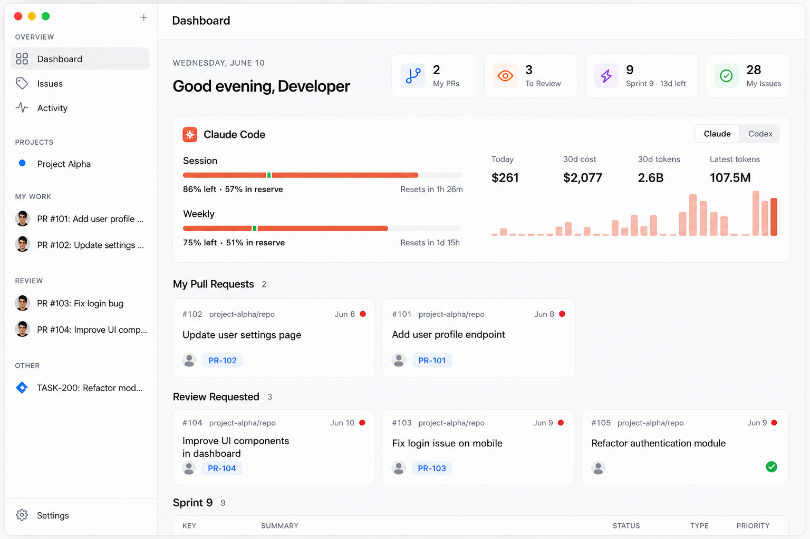
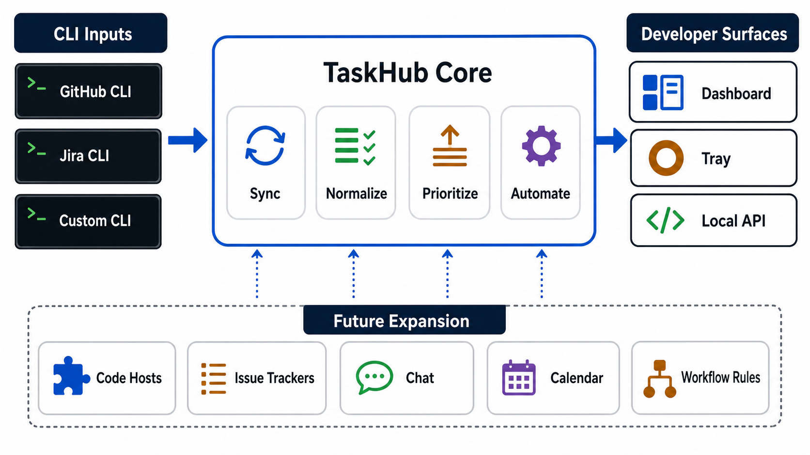

# TaskHub

**A local dashboard and macOS app, with a menu-bar signal, for developers who live in GitHub,
Jira, and the terminal.**

The production macOS client is in [`macos/`](macos/README.md): SwiftUI dashboard,
Cocoa sidebar, native Ghostty terminal, native Sprint Board/diff/editor, and a
separate Rust API process. It ships no Node runtime or TaskHub JavaScript.

[](#quick-start)
[](#native-macos-app)
[](#cli-native)
[](#license)

TaskHub turns the CLIs you already trust into a fast local task hub. It watches
your pull requests, review requests, CI state, Jira tickets, and worktrees, then
keeps the active queue visible in a native app and a tiny macOS tray signal.

No hosted backend. No new API tokens to paste into another app. Just
authenticated CLI tools, local SQLite snapshots, and a UI built for the daily
review loop.



## Highlights

- **CLI-native** - reads GitHub through `gh`, Jira through Atlassian's `acli`,
  and local repository state through `git`.
- **Local-first** - data stays in local SQLite files; the UI reads snapshots
  instead of calling hosted APIs on every click.
- **Built for review flow** - groups your authored PRs, review requests, CI
  state, Jira links, drafts, and approvals.
- **Project-aware** - each project maps to one GitHub repo, optional Jira JQL,
  workspace path, color, and merge transition.
- **Menu-bar signal** - the tray shows Tasks and Review items without keeping a
  window front and center.
- **Developer surfaces** - dashboard, project pages, activity logs, terminals,
  worktree actions, and Claude/Codex usage at a glance.

## Native macOS App

Requires macOS, Xcode, authenticated `gh`, and `acli` for Jira features. Rust is
installed for you if missing.

```bash
open macos/TaskHub.xcodeproj   # then press ⌘R
```

That is the whole setup. The scheme's build pre-action runs
`macos/scripts/bootstrap.sh`, which installs rustup if needed, downloads the pinned
Ghostty terminal runtime, and builds the Rust backend and PTY helper.

The backend is linked **into** the app as a static library and called over a C ABI, so
there is no port to manage and no child process in the normal path. Packaged apps carry
`taskhub-ptyd` in `Contents/Helpers`.

## How It Works

TaskHub uses stale-while-revalidate over local snapshots:

```text
gh / acli / git
      |
poller + webhook forwarder
      |
SQLite snapshots
      |
Rust API (linked into the app)
      |
SwiftUI app + tray + terminals
```



The poller owns normal CLI reads and writes lean snapshots. API endpoints serve
those snapshots instantly, and stale reads trigger background refreshes. Open
screens update from broadcast change events — delivered in-process when the backend is
embedded, over SSE when it runs separately.

The important invariant: normal UI reads should stay snapshot-backed. If data
needs to be fresher, improve the sync path instead of adding CLI calls to request
handlers.

For the deeper process and folder layout, see
[docs/ARCHITECTURE.md](docs/ARCHITECTURE.md).

## CLI-Native

TaskHub intentionally keeps auth in the tools you already use:

- GitHub data comes from the authenticated `gh` CLI.
- Jira data comes from the authenticated Atlassian `acli` CLI.
- Git data comes from local repositories and worktrees.
- The app and tray read local snapshots through TaskHub's own API.

This keeps the app small, inspectable, and compatible with your existing
terminal setup.

## Project Layout

| Path | Purpose |
| --- | --- |
| `crates/taskhub-backend` | Production Rust API, poller, CLI integrations, and SQLite stores |
| `crates/taskhub-ptyd` | Detached native terminal daemon |
| `crates/taskhub-vt` | Headless Ghostty VT engine used for terminal snapshots |
| `macos` | The SwiftUI/AppKit client, its tests, and packaging |
| `docs` | Architecture notes and project images |

The repository is Swift and Rust only. There is no JavaScript, Node, web renderer or
Tauri host; `AGENTS.md` and `CLAUDE.md` describe the current shape.

## Development

```bash
open macos/TaskHub.xcodeproj    # ⌘R runs the app; bootstrap.sh handles the Rust side

cargo test --manifest-path crates/taskhub-backend/Cargo.toml
xcodebuild test -project macos/TaskHub.xcodeproj -scheme TaskHub \
  -derivedDataPath macos/.build/xcode -only-testing:TaskHubTests
```

Useful notes:

- `crates/taskhub-backend/src/poller.rs` is the only GitHub sync path.
- `data.db` and `logs.db` are regenerable caches; `taskhub.db` is durable app config.
- Set `TASKHUB_DATA_DIR` to choose a custom data directory.
- `--backend-path <binary>` runs the backend as a child process and `--backend-url
  <origin>` points at one you started yourself, instead of the embedded default.
- If `gh webhook` is missing, polling still catches merges. Install the extension with
  `gh extension install cli/gh-webhook` for faster webhook-based updates.

## Releasing

Build the native Release scheme, run `macos/scripts/bundle-backend.sh`, and package
with `macos/scripts/package-direct.py --local`. See [the native guide](macos/README.md)
for exact commands and optional Developer ID/notarized distribution. The current
local review package is `macos/.build/review-20260914-rust-final/`.

The Rust helper also provides `backup`, `verify`, and `restore`; packaged startup
checks existing data before migrations. See [data recovery](docs/DATA-RECOVERY.md).

## Ideas Worth Building

- Desktop notifications for failed CI or new review requests.
- Multi-provider adapters for GitLab, Linear, Azure DevOps, or custom CLIs.
- Keyboard-first command palette.
- Per-project rules for labels, branches, and Jira transitions.
- Lightweight plugin hooks for custom task sources.
- Windows and Linux tray support.

## Contributing

Contributions are welcome. Small, visible improvements are the best place to
start: dashboard ergonomics, parser tests, clearer setup errors, and better docs
for common workflows.

Before changing data flow, keep the snapshot invariant in mind: request handlers
should stay thin, and long-running CLI work should live in services or
repositories.

## License

ISC — see the `license` field in each crate's `Cargo.toml`.
